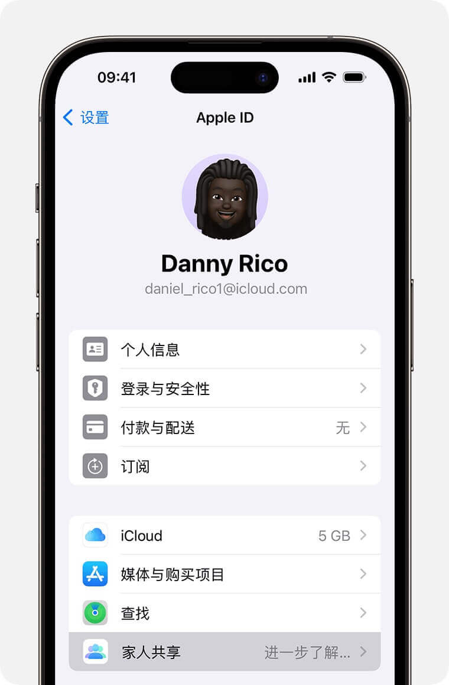
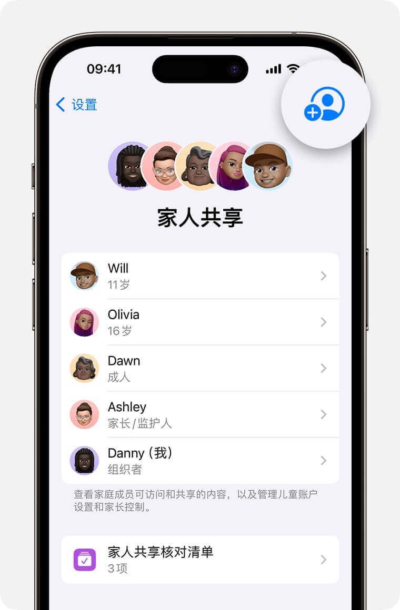

# 家人共享

如果你购买的车票票会员支持苹果家人共享，可参考以下步骤进行设置。

## 1. 设置家人共享

### 建立家庭群组（组织者操作）

打开“设置”App，轻点你的姓名 > “家人共享”，轻点“设置你的家庭”，然后按照屏幕上的说明来设置家庭、邀请家庭成员。

### 邀请家人加入（组织者操作）

打开“设置”App，轻点“家人共享” > “添加成员” > “邀请他人”。

被邀请人可以在你的设备上输入自己的 Apple ID 密码来接受邀请。

### 加入家庭群组（家人操作）

邀请家人后，家人会收到电子邮件或短信，可在邮件或短信中接受邀请。

### 开启购买项目共享（组织者、家人操作）

打开“设置”App，轻点你的姓名 > “家人共享” > “购买项目共享”，轻点“继续”，然后按照屏幕上的说明开启购买项目共享。

### 注意

* 一个人同一时间只能是一个家庭的成员
* 成员之间App Store账号设置的地区需相同
* **🔴 组织者、家人均需开启购买项目共享**

### 苹果官方文档

* [设置“家人共享”](https://support.apple.com/zh-cn/HT201088){:target="_self"}
* [如何与家人共享App和购买项目](https://support.apple.com/zh-cn/HT201079){:target="_self"}

## 2. 使用已共享的购买项目

### 确认购买项目共享成功（家人操作）

打开App Store，轻点右上角头像 > “已购项目” > “家庭购买项目”，确认能看到组织者共享的已购项目（如：车票票App）。

### 获取购买项目的会员权益（家人操作）

家人在App Store下载车票票App后，在车票票的会员购买页点击“恢复购买”即可获得会员权益。

### 注意

**🔴 开启购买项目共享后，需要等待一段时间（1小时~3天不等），家人才能看到共享的购买项目，并获取会员权益。**

如家人在车票票App中恢复购买失败，还请耐心等待一下，该流程由苹果完成，开发者无法干预。

如3天后依然恢复购买失败，还请联系我。感谢支持。