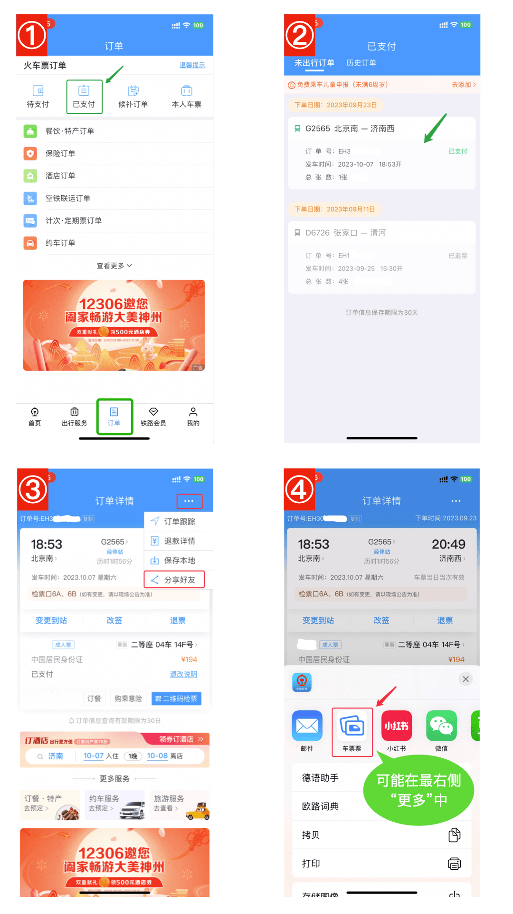
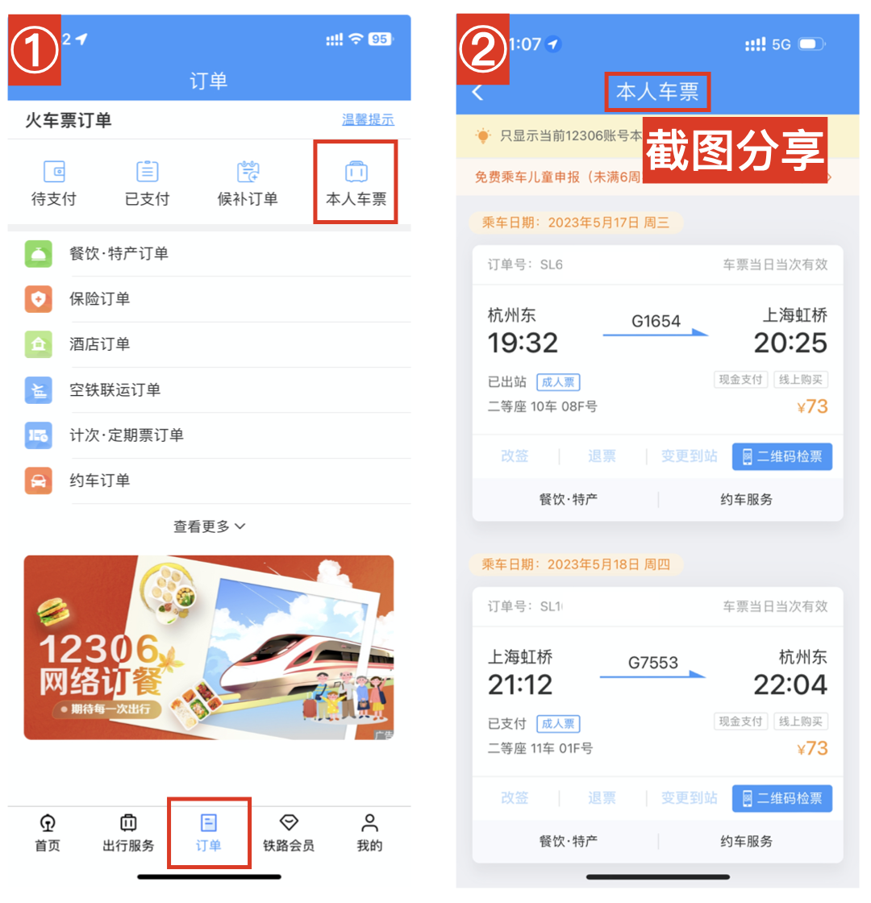
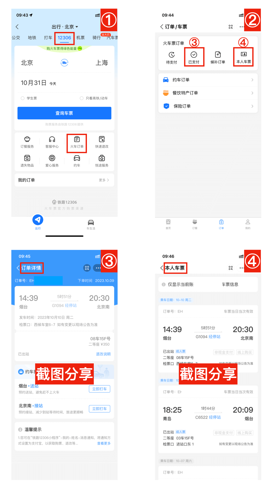
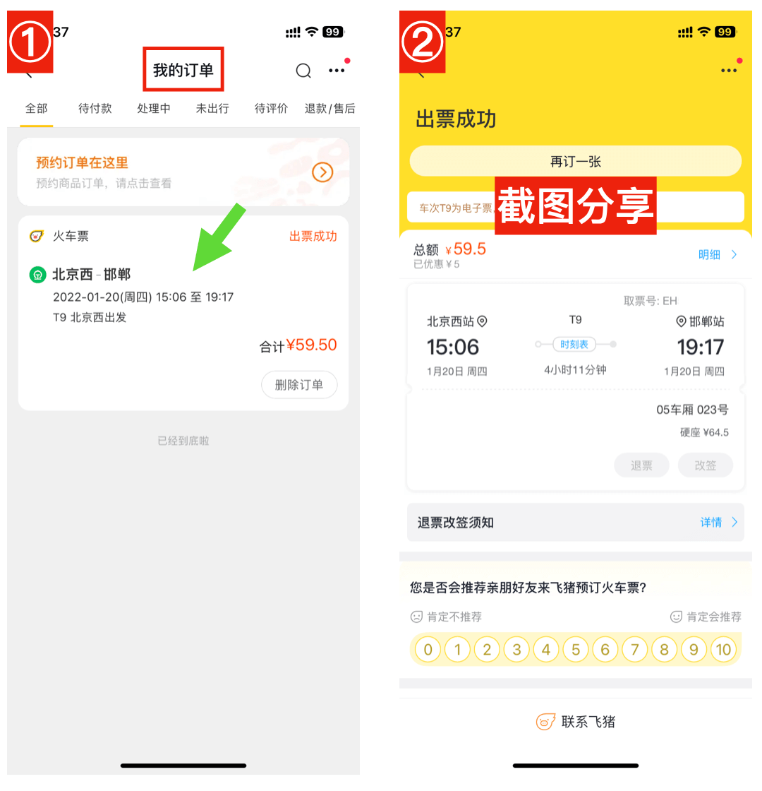

# 截图识别车票

## 1. 铁路12306 App

### 【❤️ 推荐】 订单详情页，直接分享到车票票

> **⚠️ iOS 26及以上版本**
>
> 部分运行iOS 26的机型上，“铁路12306”App分享给其他App的订单图片是空白的，导致无法识别订单内容。
>
> **替代方案**
>
> a. 添加快捷指令 [表单截图添加车票](https://www.icloud.com/shortcuts/950e4fadd96f4b75ae32f585e8f4b8c6){:target="_self"}（仅需添加一次）【快捷指令目前限会员使用】
>
> b. 12306订单详情分享好友时，在表单中选择“表单截图添加车票”
>
> 

### 本人车票页，截图后分享到车票票，或在车票票“截图识别”页选择截图

可一次添加多张车票，或添加由他人代购的车票

## 2. 支付宝12306小程序

### 订单详情页，截图后分享到车票票，或在车票票“截图识别”页选择截图

### 本人车票页，截图后分享到车票票，或在车票票“截图识别”页选择截图

可一次添加多张车票，或添加由他人代购的车票

## 3. 飞猪 App

### 订单详情页，截图后分享到车票票，或在车票票“截图识别”页选择截图

