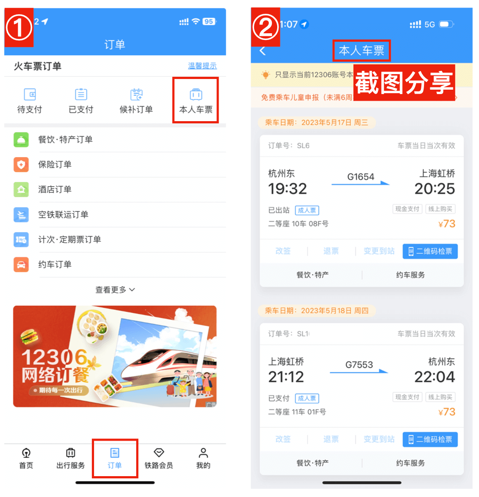

# 截图识别车票

## 1. 铁路12306 App

* 【❤️ 推荐】 订单详情页，直接分享到车票票

* 本人车票页，截图后分享到车票票，或在车票票“截图识别”页选择截图【可一次添加多张车票，或添加由他人代购的车票】

## 2. 支付宝12306小程序

* 订单详情页，截图后分享到车票票，或在车票票“截图识别”页选择截图
* 本人车票页，截图后分享到车票票，或在车票票“截图识别”页选择截图【可一次添加多张车票，或添加由他人代购的车票】

## 3. 飞猪 App

* 订单详情页，截图后分享到车票票，或在车票票“截图识别”页选择截图

