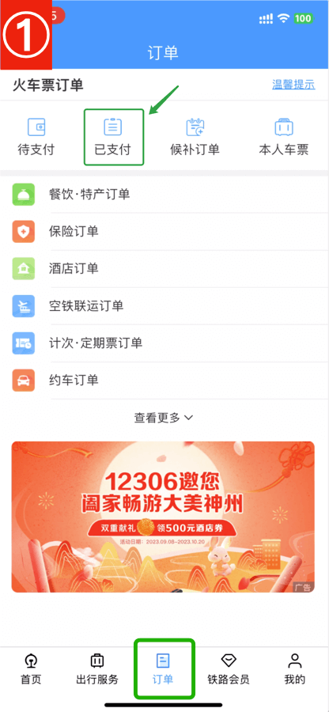
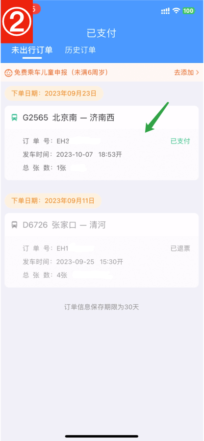
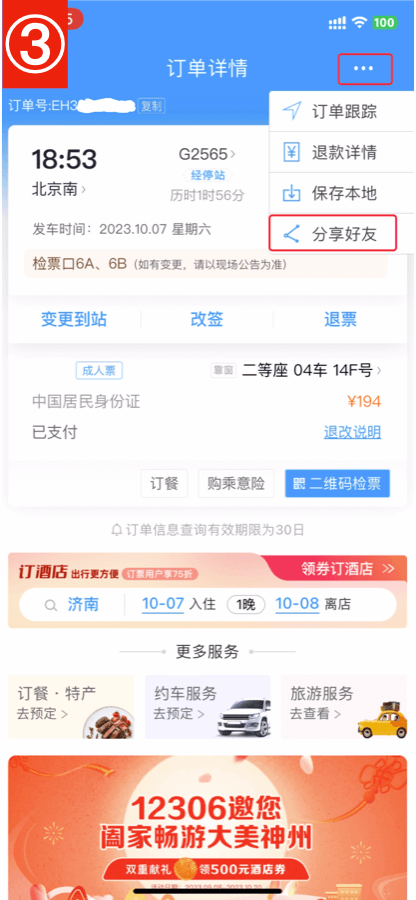
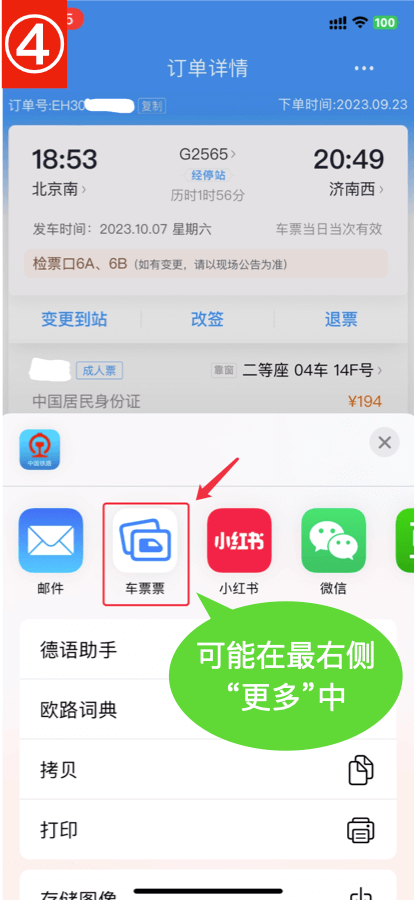
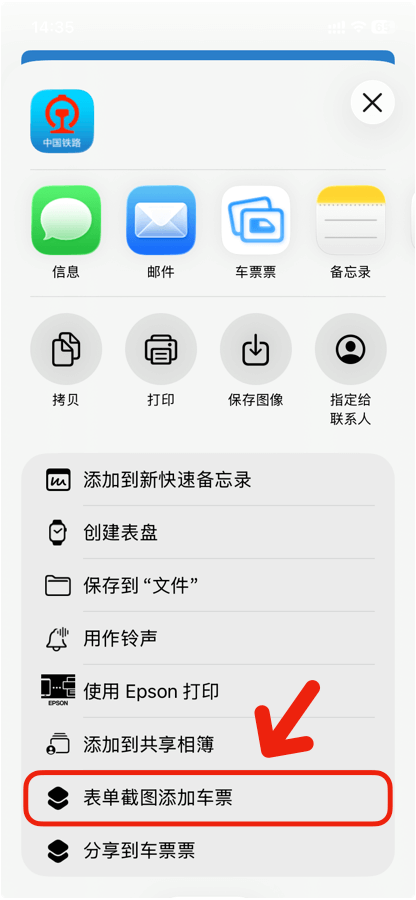

# 12306订单分享到车票票

铁路12306 App

## 1. 订单tab，已支付

## 2. 点击订单

## 3. 点击右上角三个点，分享好友

## 4. 选择车票票

> **⚠️ iOS 26及以上版本**
>
> 部分运行iOS 26的机型上，“铁路12306”App分享给其他App的订单图片是空白的，导致无法识别订单内容。
>
> 替代方案见下文。

# iOS 26替代方案

a. 添加快捷指令 [表单截图添加车票](https://www.icloud.com/shortcuts/950e4fadd96f4b75ae32f585e8f4b8c6){:target="_self"}（仅需添加一次）【快捷指令目前限会员使用】

b. 12306订单详情分享好友时，在表单中选择“表单截图添加车票”

