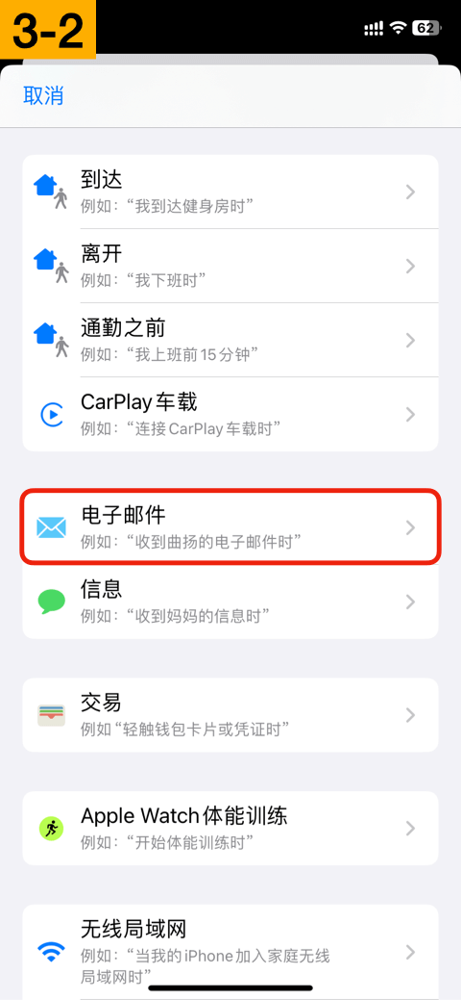
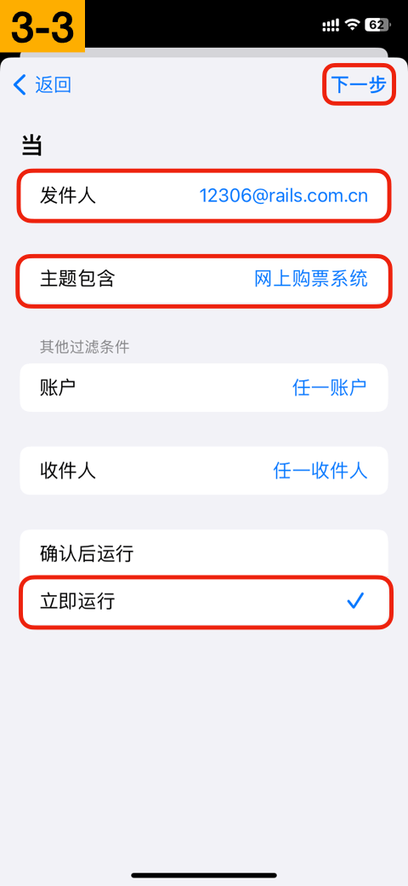

# 从12306邮件自动提取车票

## 1. 配置邮箱账户

打开系统设置，邮件 > 账户，点击“添加账户”。

👉 推荐 `@icloud.com` 邮箱，系统推送邮件更及时。也可以选择其他支持推送的邮箱。

抓取新数据，选择“推送”。

## 2. 12306绑定邮箱

打开“铁路12306”App，切到“我的”tab，点击左上角头像，点击“邮箱”，填写上一步配置的邮箱。

👉 设置邮箱后会收到核验邮件，请及时核验。

👉 邮件可能在垃圾邮件中，需移到收件箱，避免后续收不到邮件通知。

## 3. 配置自动化

> 👑 车票票快捷指令为会员功能

打开“快捷指令”App，切到“自动化”tab，点击“新自动化”（或者右上角加号），选择“电子邮件”。

↓ 填写发件人、主题包含，然后勾选“立即运行”，点击右上角“下一步”。

* 发件人：12306@rails.com.cn
* 主题包含：网上购票系统

↓ 点击“新建空白自动化”、“添加操作”。搜索“获取文本”，选择“从输入中获取文本”。

↓ 接着搜索“车票票”，选择“文本提取车票”。关闭“运行时显示”开关，点击右上角“完成”。

## 测试一下（可选）

可以买一张8天以后的车票（退票免手续费），测试一下整体流程是否正常。