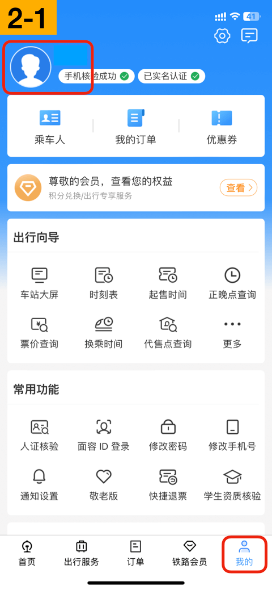

# 从12306邮件自动提取车票

功能整体流程：从12306购票 > 收到邮件 > 触发自动化导入车票。

## 1. 配置邮箱账户

打开系统设置，邮件 > 账户，点击“添加账户”。

抓取新数据，选择“推送”。请务必点开确认一下当前添加的账户抓取新数据的方式为“推送”。

👉 推荐添加 `@icloud.com`、`@qq.com`、`@163.com`、`@outlook.com` 等支持「推送」的邮箱，收取新邮件更及时。

👉 部分邮箱（如QQ、163等邮箱）需到后台开启IMAP/SMTP服务，并获取「授权码」作为本地邮箱客户端的密码。

## 2. 12306绑定邮箱

打开“铁路12306”App，切到“我的”tab，点击左上角头像，点击“邮箱”，填写上一步配置的邮箱。

👉 设置邮箱后会收到核验邮件，请及时核验。

👉 邮件可能在“垃圾邮件”中，请移至“收件箱”，避免后续收不到邮件通知。

👉 如果你为邮箱设置了自定义规则，收到12306邮件后自动移至某个文件夹，请取消此规则，确保12306邮件在“收件箱”中，否则“自动化”将无法触发。

## 3. 配置自动化

> 👑 车票票快捷指令为会员功能哦

打开“快捷指令”App，切到“自动化”tab，点击“新自动化”（或者右上角加号），选择“电子邮件”。

填写发件人、主题包含，然后勾选“立即运行”，点击右上角“下一步”。

* 发件人：12306@rails.com.cn
* 主题包含：网上购票系统

点击“新建空白自动化”、“添加操作”。

搜索“获取文本”，选择“从输入中获取文本”。

点击“输入”，选择“输入快捷指令的信息”。

点击“输入快捷指令的信息”，选择“内容”。

点击上一步页面底部的搜索框，搜索“车票票”，选择“文本提取车票”。

关闭“运行时显示”开关，点击右上角“完成”。

至此，所有配置已完成。

## 测试一下（可选）

可以买一张8天以后的车票（退票免手续费），测试一下整体流程是否正常。

用户反馈，收到候补兑现成功的邮件时，无法触发自动化，可能跟收到邮件时手机处于锁屏状态有关。